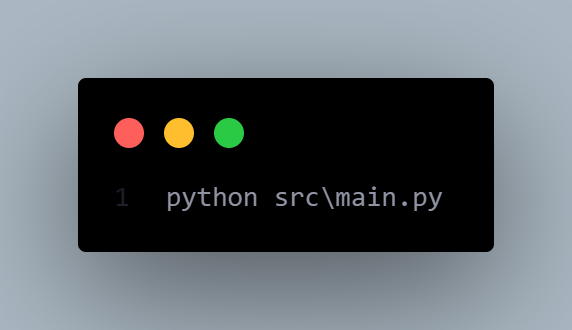

# V | A space science AI chatbot powered by [Qwen2.5](https://qwenlm.github.io/blog/qwen2.5/)


[](https://github.com/CoderRony955/V/blob/main/LICENSE)


<p align="center">
  
</p>


V is a space science AI chatbot **Powered by Ollama [Qwen 2.5](https://qwenlm.github.io/blog/qwen2.5/)**, this chatbot is designed to provide insightful and accurate information about space science. Whether you're curious about black holes, exoplanets, rocket technology, or the mysteries of the universe, this AI assistant is here to help. With a deep knowledge of astrophysics, space exploration, and cosmology, it can answer your questions, explain complex concepts, and even provide the latest updates from the space industry.

<p align="center">
  
</p>

> **Note**: I created this chatbot using **Ollama** open source model which name is [Qwen2.5](https://qwenlm.github.io/blog/qwen2.5/). You use and run this web based chatbot on your local machine with the help of any other **open source model** which is available on [Ollama](https://ollama.com/), for more instuction like how to do it read given instuctions here - [How to use?](#installation)


## Features

- Deep Space Knowledge: Expanded database on astrophysics, black holes, dark matter, and cosmic phenomena.
  
- Real-Time Space Updates: Stay informed with the latest news on NASA, SpaceX, and upcoming space missions.
  
- Interactive Q&A Mode: Engage in detailed discussions, simulations, and hypothetical space scenarios.
  
- Planet & Exoplanet Insights: Learn about habitable worlds, planetary atmospheres, and space colonization.
  

## Usage


<p align="center">
  
</p>


<p align="center">
  
</p>


## prerequisites
- [Python3](https://www.python.org/download/)
- [Ollama](https://ollama.com/)
- [Flask](https://flask.palletsprojects.com/en/2.3.x/)

## Installation
1. Install [Ollama](https://ollama.com/) and [Flask](https://flask.palletsprojects.com/en/2.3.x/) on your machine. One more thing you also need to have [Python3](https://www.python.org/download/) on your machine.

2. Select any model from [Ollama](https://ollama.com/) and download it as per your system configurations.
<p align="center">
  
</p>


3. After successfully downloading the model, Clone the repository: 
```sh
git clone https://github.com/CoderRony955/V.git
```
4. Navigate to the project directory: 
```sh
cd V
```
5. Install dependencies: 
```sh
pip install -r requirements.txt
```
> note: It's better to create a virtual environment and then install the dependencies inside the virtual environment.

6. Navigate to `model` folder
```sh
cd model
```

7. Create `Modelfile` file in `model` folder and then give system prompt to the model which you install from [Ollama](https://ollama.com/).

e.g.
<p align="center">
  
</p>


8. Start the chatbot: 
```sh
python src/main.py
```
<p align="center">
  
</p>


9. Access the chatbot in your browser: `http://localhost:5000`

<p align="center">
  
</p>


## V discord bot
**V** also has a discord bot which you can use to chat with **V** directly from your discord server.

### To use the V discord bot
1. Navigate to the `V-discord-bot` folder.
2. Add your `Bot-Token` in the `logic.py` file.

<p align="center">
  
</p>

3. Run the bot using `python logic.py` command in your terminal.

## Acknowledgments
- [Ollama](https://ollama.com/) & [Qwen 2.5](https://qwenlm.github.io/blog/qwen2.5/) – For providing the powerful AI model that drives this chatbot.

- [Python](https://www.python.org/) & Open-Source Community – For the amazing tools and libraries that made this project possible.

## My Socials

<a href="https://www.instagram.com/__raunakk__/" target="_blank">
    
  </a>
<a href="https://discord.gg/SK9k6mdzvP" target="_blank">
    
  </a>
